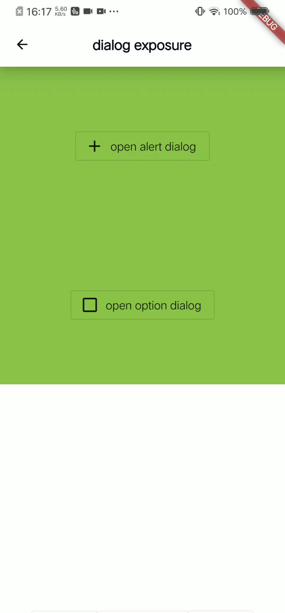

自动曝光 Widget
====
这是一个能自动监听子Widget是否曝光的组件<br/>
当发现子Widget在视窗内，停留时长超过设置的曝光时长条件（默认为0.5s）和曝光面积大于曝光展示比例条件（默认50%）<br/>
就会触发曝光回调并且将Key值记录到一个队列（默认最大存储100个Key）中，以后遇到队列中的Key值，不再进行曝光检测

安装
----

将下列代码加入到pubspec.yaml文件
```yaml
dependencies:
  exposure: ^1.0.0
```

用法
----
```dart
ExposureDetector({
    key: Key('exposure'),  // 自定义Key值
    child: childWidget, //子widget
    exposure: callBack // 曝光回调
});
```
####示例代码

[列表滑动模块曝光](./example/exposureScrollExample.dart)


[动画模块曝光](./example/exposureAnimateExample.dart)


[弹窗曝光](./example/exposureDialogExample.dart)



配置
---

* ExposureDetectorController.instance.setFilterList：Function 设置缓存key值队列<br/>
* ExposureDetectorController.instance.exposureTime：int 设置曝光时长 (ms)<br/>
* ExposureDetectorController.instance.exposureFraction：double 设置曝光比例<br/>
* ExposureDetectorController.instance.updateInterval：Duration 设置延时检测时间